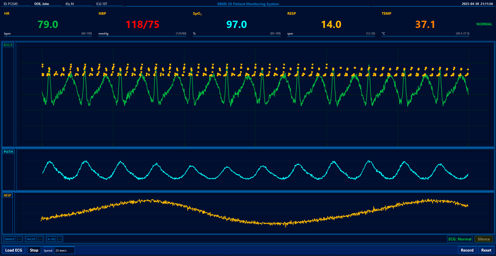
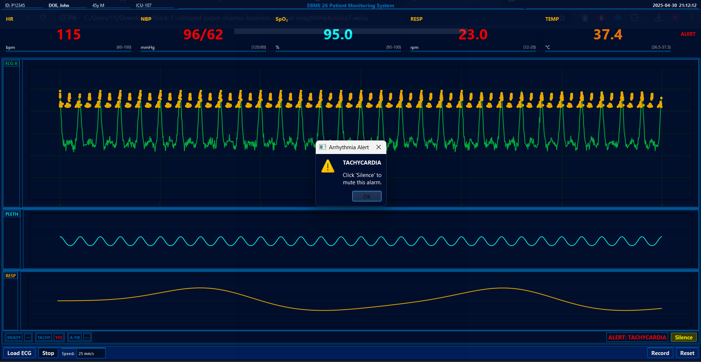

# 🏥 Patient Monitoring System

<div align="center">
  


[](https://www.python.org/downloads/)
[](https://pypi.org/project/PyQt5/)
[](LICENSE)

*Professional medical monitoring system with arrhythmia detection*
</div>

## 📋 Table of Contents
- [Overview](#overview)
- [Features](#features)
- [Implementations](#implementations)
- [Screenshots](#screenshots)
- [Installation](#installation)
- [Usage](#usage)
- [Arrhythmia Detection](#arrhythmia-detection)
- [Demo Data](#demo-data)

## 🔍 Overview

This patient monitoring system simulates professional medical equipment that displays real-time ECG signals and vital signs. The system features automatic arrhythmia detection algorithms capable of identifying bradycardia, tachycardia, and atrial fibrillation, with alarm functionality to alert medical staff when abnormal heart rhythms are detected.

## ✨ Features

### Waveform Displays
- **ECG Waveform** 💚 - High-fidelity electrocardiogram with R-peak detection
- **Plethysmogram (SpO₂)** 💙 - Oxygen saturation waveform 
- **Respiration Waveform** 💛 - Visual representation of breathing patterns

### Vital Sign Monitoring
| Parameter | Normal Range | Color |
|-----------|--------------|-------|
| Heart Rate (HR) | 60-100 BPM | Green |
| Blood Pressure (NBP) | 120/80 mmHg | Red |
| Oxygen Saturation (SpO₂) | 95-100% | Cyan |
| Respiration Rate (RESP) | 12-20 rpm | Yellow |
| Temperature (TEMP) | 36.5-37.5°C | Orange |

### Arrhythmia Detection
- ⚠️ **Bradycardia** - Slow heart rate (<60 BPM)
- ⚠️ **Tachycardia** - Fast heart rate (>100 BPM)
- ⚠️ **Atrial Fibrillation** - Irregular heart rhythm

## 💻 Implementations

The project includes two implementations:

### PyQt Desktop Application
- Professional medical device styling based on Philips monitors
- Real-time waveform rendering with Matplotlib
- Complete vital sign display with clinical alarms

### Dash Web Interface
- Responsive design works in any modern browser
- Interactive waveform displays with Plotly
- Accessible from any device

## 📸 Screenshots

<div align="center">
  
  <p><i>Main monitoring interface showing ECG, SpO₂ and respiration waveforms with vital signs</i></p>
</div>

<div align="center">
  
  <p><i>Tachycardia detection with visual alarm</i></p>
</div>

## 🔧 Installation

### PyQt Implementation
```bash
# Install required packages
pip install PyQt5 matplotlib numpy pandas

# Run the application
python task1.py
```

### Dash Implementation
```bash
# Install required packages
pip install dash dash-bootstrap-components plotly pandas numpy flask

# Run the application
python dash_monitor.py
```

## 🚀 Usage

1. **Start Monitoring** - Click the "Start" button to begin real-time simulation
2. **Load ECG Data** - Import custom ECG data from CSV files
3. **Adjust Display Speed** - Select from 12.5, 25, or 50 mm/s
4. **Respond to Alarms** - Click "Silence" to temporarily mute alerts
5. **Reset Display** - Restart monitoring from the beginning

## ❤️ Arrhythmia Detection

The system uses the following algorithms to detect arrhythmias:

- **Bradycardia**: Heart rate < 60 BPM
- **Tachycardia**: Heart rate > 100 BPM
- **Atrial Fibrillation**: Combination of heart rate variability and irregular intervals

## 📊 Demo Data

The simulation includes a 60-second demo with various cardiac events:

| Time (s) | Condition | Heart Rate | Description |
|----------|-----------|------------|-------------|
| 0-20 | Normal | 70-80 BPM | Baseline normal sinus rhythm |
| 20-30 | Tachycardia | 115-130 BPM | Fast heart rate episode |
| 30-40 | Normal | 70-80 BPM | Return to normal rhythm |
| 40-50 | Bradycardia | 40-55 BPM | Slow heart rate episode |
| 50-60 | Normal | 70-80 BPM | Return to normal baseline |

---

<div align="center">
  
Developed by SBME 26 Team for Medical Instrumentation Course

</div>
